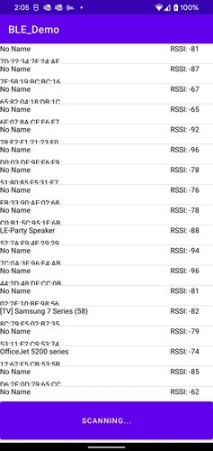
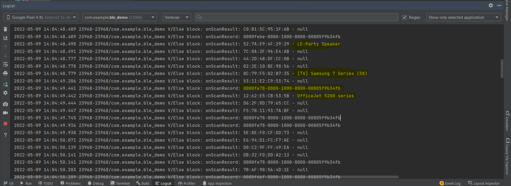

# Read Me Template

BLE Scanner

---

### Table of Contents

- [Description](#description)
- [How To Use](#how-to-use)
- [References](#references)
- [Author Info](#author-info)

---

## Description

This project implements bluetooth scanning using Bluetooth low energy signals.

#### Technologies

- Bluetooth
- Location

[Back To The Top](#read-me-template)

---

#### Installation
You will need a phycial device to scan real time nearby ble devices. After installing Application, make sure you have given bluetooth and location permission to the app to make sure it works.

---

### ScreenShots

## References
[Back To The Top](#read-me-template)

---

## License

MIT License

Copyright (c) [2017] [James Q Quick]

[Back To The Top](#read-me-template)

---

## Author Info

- Twitter - [@jamesqquick](https://twitter.com/jamesqquick)
- Website - [James Q Quick](https://jamesqquick.com)

[Back To The Top](#read-me-template)
